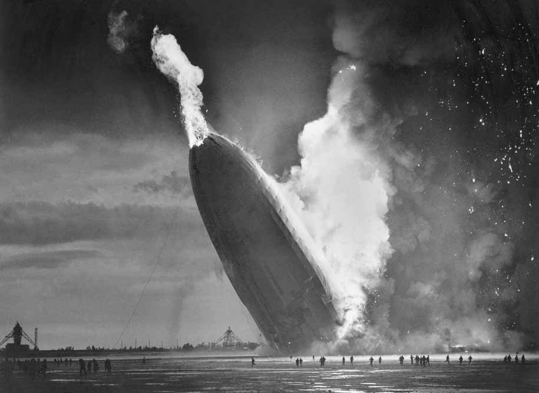
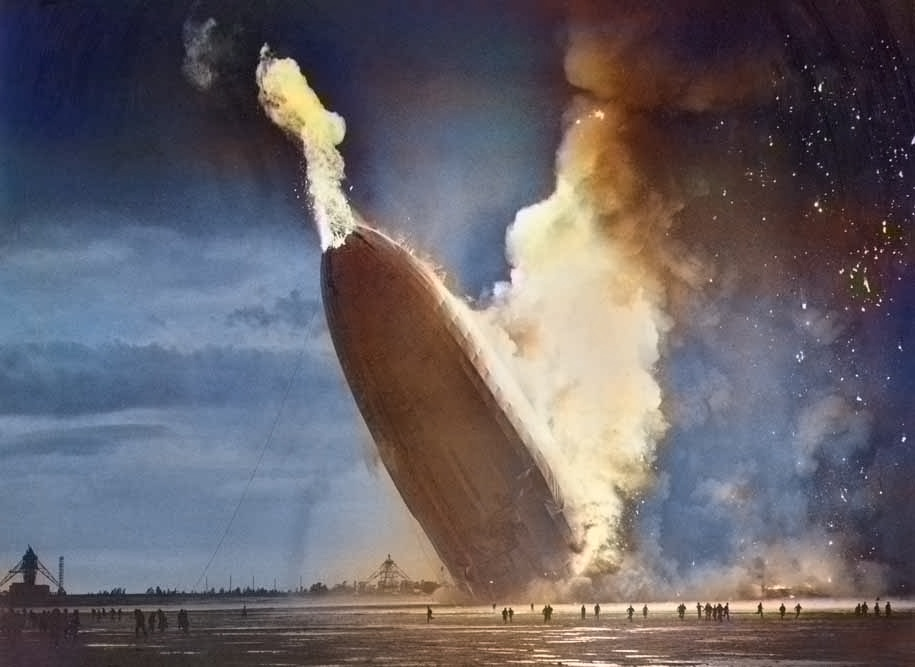
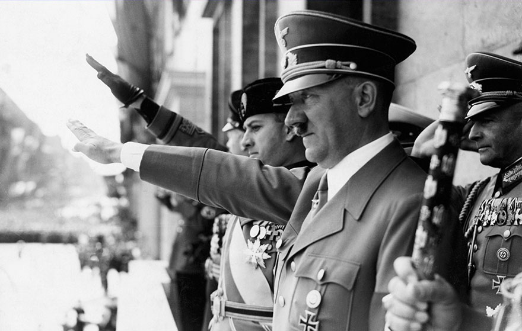
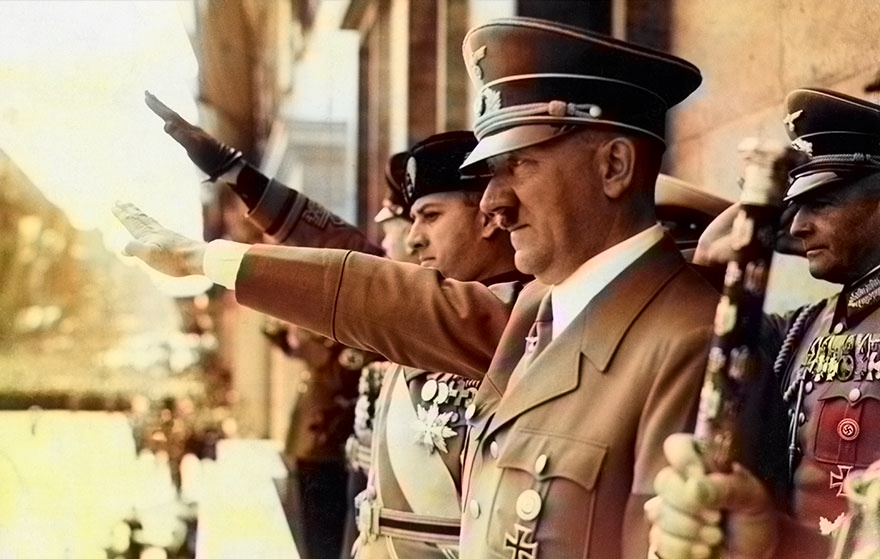
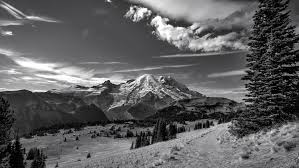
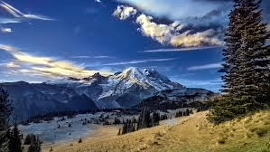
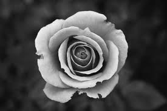
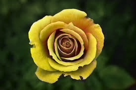
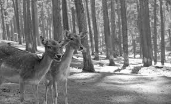
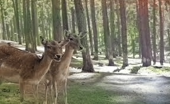

# Colorizing Black & White Images
The idea behind this project is to develop a fully automatic approach that will generate realistic colorizations of Black & White (B&W) photos. The underlying uncertainty of the problem is treated as a classification task using class-rebalancing at training time to increase the diversity of colors in the result. The Deep Learning approach is implemented as a feed-forward pass in a CNN (“ Convolutional Neural Network”) at test time and is trained on over a million color images.

|     ORIGINAL B&W IMAGE       |  COLORIZED IMAGE    |
| :-------------- | :----------: |
|   |     | 
|   |  |  
|     | |
|     |  |
|     |  |
